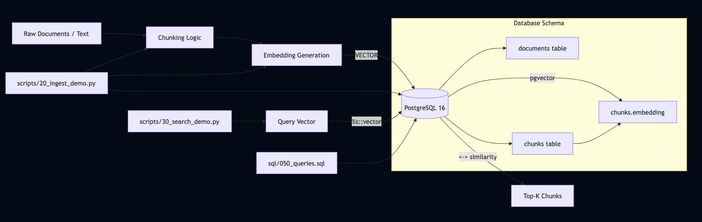

# pgvector Semantic Search Demo (PostgreSQL)


A clean learning/demo repository showing how to use **PostgreSQL + pgvector** for vector similarity search.  
Structured like a real project and easy to extend into **RAG** or **ML pipelines**.

This repository focuses on **clarity, correctness, and real-world structure**, rather than minimal examples.

## Architecture Overview



## What this repo demonstrates
- pgvector extension setup
- RAG-friendly schema (documents + chunks + embeddings)
- Python ingestion + search scripts
- Vector columns using `VECTOR(n)`
- Similarity search using native PostgreSQL operators
- SQL-first querying with optional Python helpers
- A project layout that mirrors production systems

---

## Goal of this Repository

- Demonstrate how **pgvector** enables vector similarity search inside PostgreSQL
- Show a **RAG-friendly schema** (documents → chunks → embeddings)
- Keep everything **simple, readable, and extensible**
- Serve as a foundation for:
  - semantic search
  - retrieval-augmented generation (RAG)
  - ML / NLP pipelines
  - in-database vector workloads

---

## Do I Need PostgreSQL?

**Not necessarily.**

This repository is designed to be **useful even without a local PostgreSQL installation**:

- SQL scripts can be reviewed directly
- Python scripts show ingestion and search logic
- Schema and queries illustrate real pgvector usage
- The structure itself demonstrates best practices

To **run the demo end-to-end**, you will need PostgreSQL with the `pgvector` extension installed.

---

## Prerequisites (to run the demo)

Only required if you want to execute the code locally.

- PostgreSQL ≥ 15
  - Recommended on macOS: **Postgres.app**
- `psql` available in your terminal
- `uv` installed (Python environment & dependency manager)

---

## Repository Structure

```text
.
├── sql/
│   ├── 001_create_extension.sql
│   ├── 002_create_tables.sql
│   ├── 003_sample_data.sql
│   └── 050_queries.sql
│
├── scripts/
│   ├── 00_check_connection.py
│   ├── 10_init_db.py
│   ├── 20_ingest_demo.py
│   └── 30_search_demo.py
│
├── pyproject.toml
├── uv.lock
└── README.md
```

---

## Quickstart (uv)

### 1) Create virtual environment and install dependencies
``` bash
uv venv
uv pip install psycopg2-binary python-dotenv
uv lock
```

---

### 2) Initialize database and schema
``` bash
uv run python scripts/10_init_db.py
```

This will:
- create the database (if needed)
- enable the vector extension
- create tables for documents, chunks, and embeddings

---

### 3) Run a similarity query (SQL)
``` bash
psql -d vectordb -f sql/050_queries.sql
```

This demonstrates:
- vector distance operators
- ordering by similarity
- basic semantic search patterns

---

### 4) Ingest demo chunks (Python)
``` bash
uv run python scripts/20_ingest_demo.py
```

This simulates:
- chunk creation
- embedding insertion
- storage in PostgreSQL

---

### 5) Search via Python
``` bash
uv run python scripts/30_search_demo.py
```

This shows:
- parameterized similarity queries
- Python → SQL integration
- application-style retrieval

---

Run the Full Flow (Sanity Test)
- Make sure Postgres.app is running, then:
``` bash
uv run python scripts/00_check_connection.py
uv run python scripts/10_init_db.py
psql -d vectordb -f sql/050_queries.sql
uv run python scripts/20_ingest_demo.py
uv run python scripts/30_search_demo.py
```

---

**Notes**
- Embedding dimension is set to VECTOR(3) for a minimal demo
- For real-world usage:
- use 384 / 768 / 1536 dimensions
- add ANN indexes (HNSW or IVFFlat)
- PostgreSQL + pgvector is often sufficient for small to medium-scale RAG systems

---

**Architecture Notes**
- PostgreSQL acts as both the relational store and vector store
- pgvector enables similarity search without external databases
- This pattern works well when:
  - data already lives in Postgres
  - operational simplicity matters
  - latency requirements are moderate

---

**Possible Extensions**
- Add ANN indexes for large-scale datasets
- Plug in real embeddings (OpenAI, SentenceTransformers, etc.)
- Add a RAG layer (LLM + retriever)
- Wrap queries behind a FastAPI service
- Add Docker Compose for infra parity

## Quality & Tooling
This repository follows lightweight quality checks aligned with real-world applied projects:

- **Linting**: `pylint` (configured via `pyproject.toml`)
- **CI**: GitHub Actions
- **Environment management**: `uv` with lockfile-based reproducibility

Run linting locally:

```bash
uv sync --extra dev
uv run pylint main.py scripts
